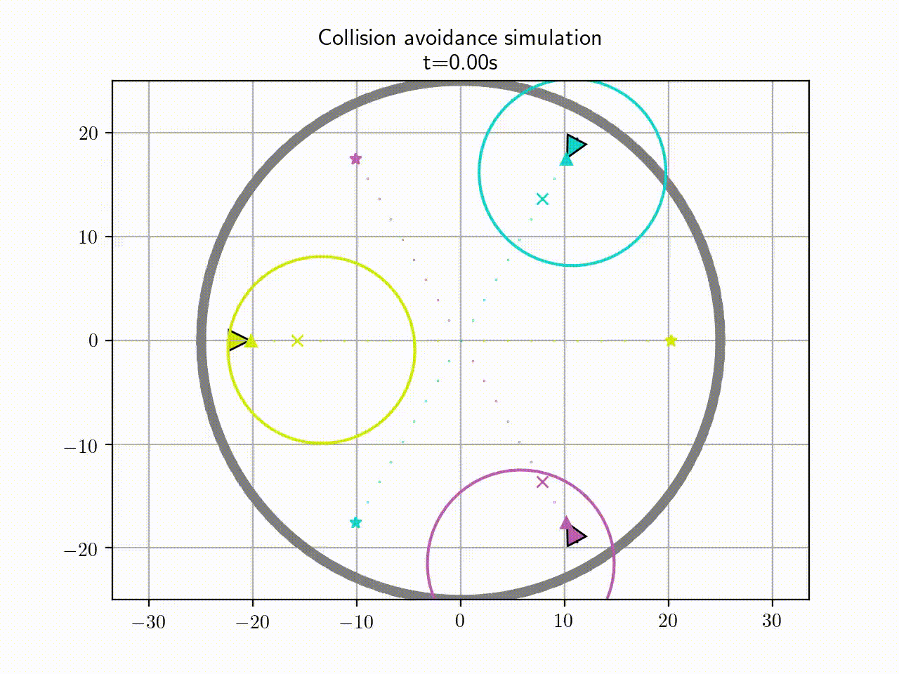
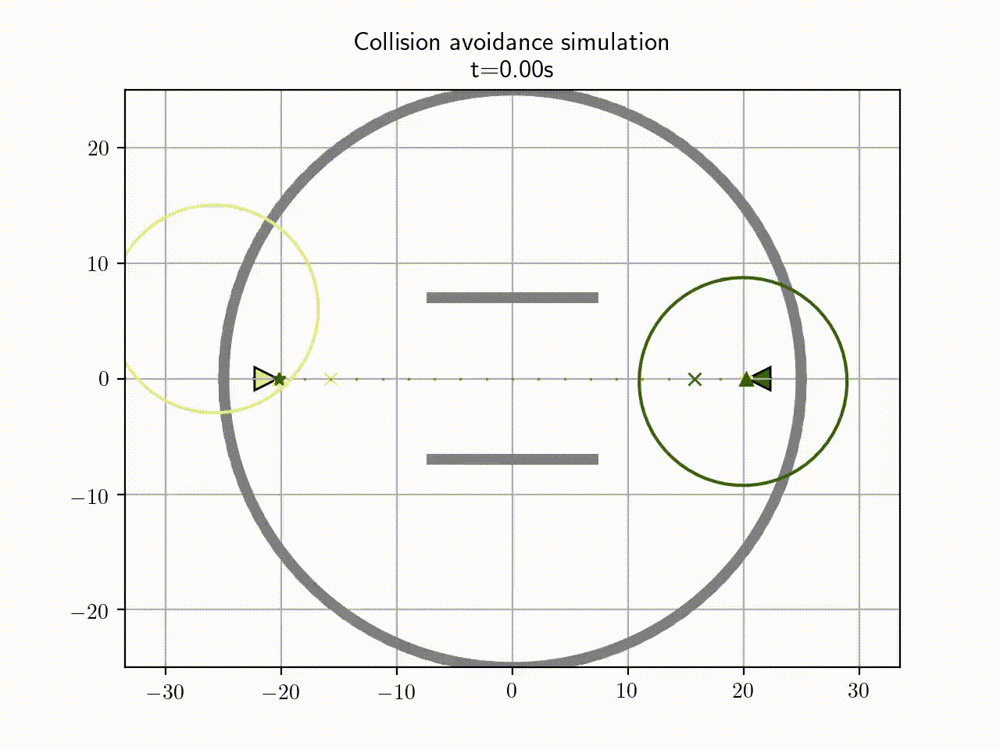

# AGV collision avoidance

Dependencies:
```
- python3
- scipy
- numpy
- matplotlib
- networkx
- sympy
- terminalplot
- casadi
- ffmpeg
```
To check the dependencies, in UNIX system it's possible to use ```install_python_dependencies.sh```.
In any case, the scripts are also proven to be working under Windows systems.

All the simulation parameters of the main simulation ```agv_collision_avoidance.py``` are modifiable from ```simulation_parameters```.
However, through command line arguments, some of them are settable or can be toggled as follows:

**Example**
```python agv_collision_avoidance.py 'rvo' 'mhe' 'central' 4 'plant'```

Launches the simulation with the RVO algorithm, 4 robots in the default plant environment, with additional centralized kalman and MHE filter.

*Additional notes*
- Mutually exclusive parameters:
  - map ```plant``` or ```polygon```
  - collision avoidance algorithm ```rvo``` or ```potential```
- the highest integer number will be the number of robots
- to decide which map to launch other then default, modify the planning in ```agv_collision_avoidance.py```
- arguments specification is **not** positional


## Potential
Collision avooidance with 3 robot encountering in the centre

Collision avooidance with 2 robot encountering in the centre with a corridor

Collision avooidance with 8 robot in a simple map


## RVO
Collision avooidance with 2 robot encountering in the centre with a corridor

Collision avooidance with 3 robot encountering in the centre

Collision avooidance with 8 robot in a simple map


